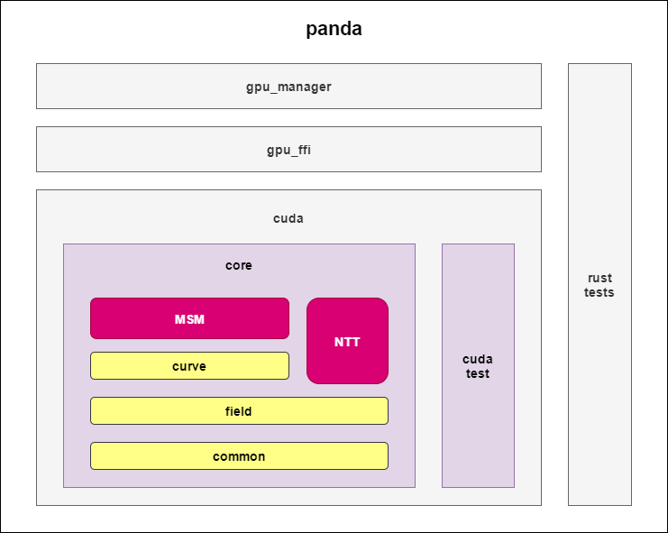

# panda
An open-source GPU library for  accelerating Zero-Knowledge-Proof.
Panda is an open GPU computing framework that absorbs excellent optimization methods, continuously improves, and optimizes. We welcome more people to participate in the development together.

## Features
- Supports multiple curves (BN254/BLS12-377 and more).
- Supports coordinate conversion, output results can be Jacobian coordinates or Projective coordinates.
- Supports msm and ntt module acceleration.
- Supports Rust API calls for msm and ntt acceleration.
- Supports cached bases and scalars.
- Good compatibility and easy to extend.

## Architecture

## Code Structure
- `src`
  - `cuda`: All CUDA source code and test code.
  - `gpu_ffi`：FFI interface code.
  - `gpu_manager`：Panda GPU manager code, mainly used to manage GPUs and external interfaces.
- `test`

## Interfaces
### Initialization Interface
Responsible for initializing hardware, creating memory pools, initializing msm modules, preloading cached bases or scalars, etc.For example: `init_hardware`, `init_msm`, etc.

### Configuration Interface
Configure parameters, get parameters and status, etc.For example: `get_device_number`, `device_info`, etc.

### Running Modules
Call different execution functions to accelerate msm and ntt modules.For example: `panda_msm_bn254_gpu`

## How to run
- If you want to use Rust API, you can refer to the `./tests/test.rs` sample code.
- Currently, the msm CUDA code calculation process uses Jacobian coordinates, so if you expect the output coordinates to be Projective coordinates, you can set the return type conversion.
- The CUDA code framework supports multiple curves, and currently encapsulates the Rust API for BN254, and it will be easy to encapsulate the Rust API for BLS12-377 later.
- We also provide host code for debugging purposes.

### Test in Rust
- Random GPU test:

`cargo test test_msm_bn254_correctness_device --release -- --nocapture`

### Test in Cuda
- `cd ./src/cuda && ./build.sh && cd build && ./test/panda_test gpu`
- We temporarily provide a set of local data.